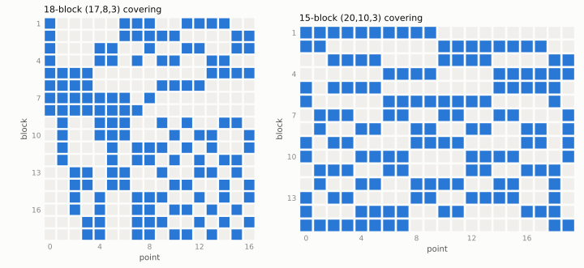
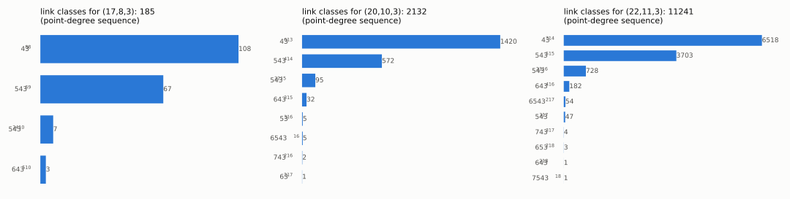
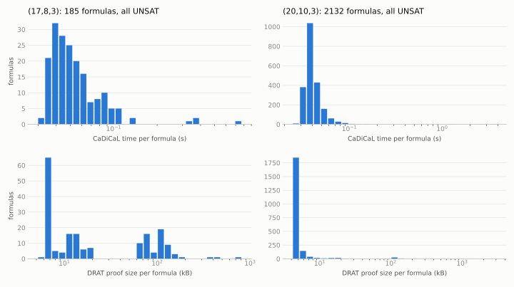

# Covering numbers $C(17,8,3)$, $C(20,10,3)$ and $C(22,11,3)$: computation and certificates

[](https://doi.org/10.5281/zenodo.23063930)

Status: **computational results, not peer reviewed.** First published 2026-09-29; $C(22,11,3)$ added 2026-09-30.

$C(v,k,t)$ is the minimum number of $k$-subsets (blocks) of a $v$-set such that every $t$-subset lies in some block.
The La Jolla Covering Repository (Zenodo record 19735294, v1.2, 2026-04-24) lists $17 \le C(17,8,3) \le 18$,
$14 \le C(20,10,3) \le 15$ and $14 \le C(22,11,3) \le 15$. The computations here find no covering with 17, 14 resp. 14
blocks, which together with the coverings in `coverings/` indicates $C(17,8,3) = 18$, $C(20,10,3) = 15$ and
$C(22,11,3) = 15$.

For $C(17,8,3)$ see also the title "The Covering Number C(17,8,3) = 18" (J. Hartley and M. A. Olson), listed without a
link on https://www.jonathanhartley.net/research as of 2026-09-29 (found after this computation was done; the two were
obtained independently).

## Method (outline)

For $(v,k,b) = (17,8,17)$, $(20,10,14)$ resp. $(22,11,14)$, counting forces every point into exactly $r = 8$, $7$ resp. $7$ blocks,
and the blocks through a point (point removed) form an optimal $`2\text{-}(v-1,k-1,1)`$ covering with $r$ blocks
($C(16,7,2) = 8$, $C(19,9,2) = 7$, $C(21,10,2) = 7$). `scripts/counting.py` checks the arithmetic for the first two;
for the third, $11 \cdot 14 = 22 \cdot 7$ and $C(21,10,2) \ge \lceil 21 \cdot 3/10 \rceil = 7$ (Schönheim).
`proofs/lb/` certifies $C(16,7,2) \ge 8$.
These link coverings are classified up to isomorphism (`scripts/enum_links.c`, `scripts/classify_links.py`,
nauty via pynauty): 185 classes for $(16,7,2)$ with 8 blocks, 2132 classes for $(19,9,2)$ with 7 blocks,
11241 classes for $(21,10,2)$ with 7 blocks (`data/links_*.json`).
For each class, `scripts/gen_ext.py` writes a CNF for the remaining blocks with the link of a root point fixed.
Root choice: let $M$ be the maximum pair degree $\lambda(pq)$ of a hypothetical covering and
$`\mu(p) = \#\{q : \lambda(pq) = M\}`$; take as root a point maximising $\mu$. Since $\lambda(pq)$ is the degree of
$q$ in the link of $p$, the root's link $L$ has maximum degree $M$ and $\mu(\text{root})$ points of that degree, so
every pair satisfies $`\lambda \le M_L`$ and every point has at most $`\mu_L`$ partners at degree $`M_L`$; these
constraints are added. Symmetry breaking: lex-leader constraints for $`\mathrm{Aut}(L) \times S_{b-r}`$ acting on the
incidence matrix of the new blocks (all other constraints are invariant, so each orbit keeps its lex-greatest
member); see the header of `gen_ext.py`. Every CNF is solved by CaDiCaL with a DRAT proof, which is checked by
drat-trim and, after conversion to LRAT, by cake_lpr.

## The family $C(2m,m,3)$ (`family/`, added 2026-09-30)

For $m \ge 4$ the Schönheim bound gives $C(2m,m,3) \ge 14$. `family/FAMILY.md` contains an argument that
$C(2m,m,3) = 14$ iff $4 \mid m$, and that $C(2m,m,3) = 15$ for $m \ge 6$ with $4 \nmid m$, $m \ne 9$. The upper
bounds are blow-ups of $\mathrm{AG}(3,2)$ and $\mathrm{PG}(3,2)$ (explicit coverings in `family/coverings/`). The lower bound
reduces, by a written argument (`FAMILY.md` §1–§4), to a finite "Key Lemma" about $\tfrac12$-balanced 3-wise
intersecting families of 7-subsets of a 14-set. The Key Lemma is checked by computer: 41 certificates
(`family/kl_certs/`), each consisting of exact Farkas certificates for linear-arithmetic lemmas and a CNF refuted
with a DRAT proof. `family/verify_kl.sh` re-checks everything from scratch (about 80 CPU minutes; tools via
`$SAT_TOOLS` as above; `--full` also re-checks the direct $m = 9$ proof). Reviews of the argument and of the
certificates are in `family/audit/`. The cases $m = 10, 11$ are also covered by the independent computations above.

## New upper bounds (`upper/`, added 2026-09-30)

Two coverings found by weighted blow-ups of finite geometries, each two blocks smaller than the best listed on
coveringrepository.com: $C(45,23,5) \le 63$ (was 65) and $C(44,24,6) \le 126$ (was 128). See `upper/README.md`.

## Archive

Release v2 is archived at Zenodo: [doi:10.5281/zenodo.23063930](https://doi.org/10.5281/zenodo.23063930)
(all versions: [doi:10.5281/zenodo.23063929](https://doi.org/10.5281/zenodo.23063929)).

## Figures

Regenerate with `python3 figures/make_figures.py` (matplotlib).

<picture>
  <source media="(prefers-color-scheme: dark)" srcset="figures/coverings_dark.svg">
  
</picture>

Incidence matrices of the coverings in `coverings/` (rows: blocks, columns: points).

<picture>
  <source media="(prefers-color-scheme: dark)" srcset="figures/links_dark.svg">
  
</picture>

Link classes (optimal $(16,7,2)$ coverings with 8 blocks; optimal $(19,9,2)$ and $(21,10,2)$ coverings with 7 blocks),
grouped by the
degree sequence of their points. One CNF per class.

<picture>
  <source media="(prefers-color-scheme: dark)" srcset="figures/instances_dark.svg">
  
</picture>

Per-formula CaDiCaL solve time and DRAT proof size, from `runs/*/results.jsonl`.

## Contents

| path | content |
|---|---|
| `scripts/` | generator and driver (`run_case.py`), covering checker (`check_covering.py`) |
| `data/links_16_7.json`, `data/links_19_9.json`, `data/links_21_10.json` | link classifications (class representatives + automorphism generators) |
| `runs/*/results.jsonl` | one row per class: CNF sha256, solver status, proof sha256, checker verdicts |
| `proofs/C17_8_3_b17/`, `proofs/C20_10_3_b14/`, `proofs/C22_11_3_b14/` | DRAT proofs (xz), one per class |
| `proofs/lb/`, `runs/lb_c16_7_2_*.log` | certificate for $C(16,7,2) \ge 8$ |
| `coverings/C17_8_3_b18.txt` | an 18-block $(17,8,3)$ covering |
| `coverings/C20_10_3_b15.txt` | the 15-block $(20,10,3)$ covering listed in the La Jolla Covering Repository |
| `coverings/C22_11_3_b15.txt` | a 15-block $(22,11,3)$ covering |
| `figures/` | figures and the script that makes them |
| `family/` | the $C(2m,m,3)$ argument, Key Lemma certificates, verifier, coverings, reviews |
| `upper/` | new coverings for $C(45,23,5)$ and $C(44,24,6)$, blow-up scan |
| `MANIFEST.sha256` | sha256 of every file |

## Reproduce

Requirements: Python 3 with `pynauty`; a C compiler; builds of CaDiCaL, drat-trim and cake_lpr in one directory
`$SAT_TOOLS` (`cadical/build/cadical`, `drat-trim/drat-trim`, `cake_lpr/cake_lpr`). Versions used:
CaDiCaL 3.0.1 (c607304), drat-trim 2e3b2dc, cake_lpr a36874a, pynauty 2.8.8.1, macOS arm64.

```sh
cc -O2 -o scripts/enum_links scripts/enum_links.c
python3 scripts/check_covering.py 17 8 3 coverings/C17_8_3_b18.txt
python3 scripts/check_covering.py 20 10 3 coverings/C20_10_3_b15.txt
python3 scripts/check_covering.py 22 11 3 coverings/C22_11_3_b15.txt
# re-run a case from scratch (regenerates every CNF; compare cnf_sha256 with runs/*/results.jsonl):
mv runs/C17_8_3_b17 runs/C17_8_3_b17.published
SAT_TOOLS=/path/to/tools python3 scripts/run_case.py 17 8 17 8 --proof     # 185 classes, ~1 min
SAT_TOOLS=/path/to/tools python3 scripts/run_case.py 20 10 14 7 --proof    # 2132 classes, ~10 min
SAT_TOOLS=/path/to/tools python3 scripts/run_case.py 22 11 14 7 --proof    # 11241 classes, ~45 min
# to also redo the link classification, delete data/links_16_7.json / data/links_19_9.json / data/links_21_10.json first
```

To check a stored proof directly: `xz -dk proofs/C17_8_3_b17/e0.drat.xz`, regenerate the CNF for class 0 with
`scripts/gen_ext.py` (see `run_case.py` for the exact arguments), then `drat-trim e0.cnf e0.drat`.
